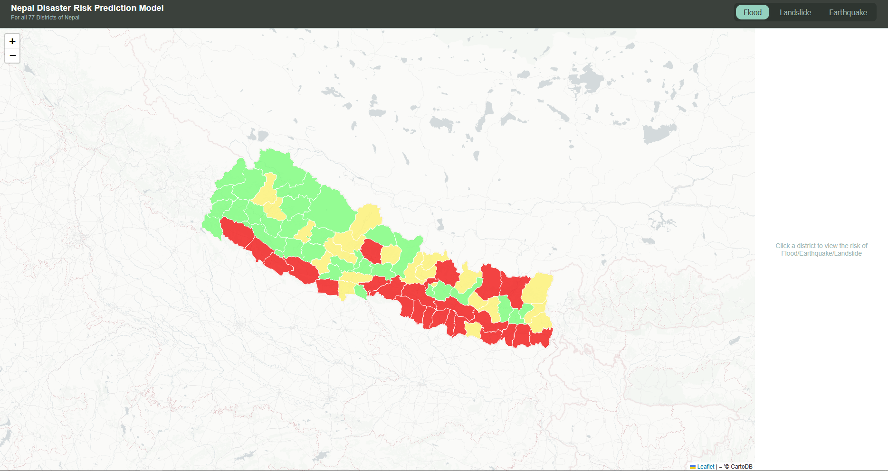
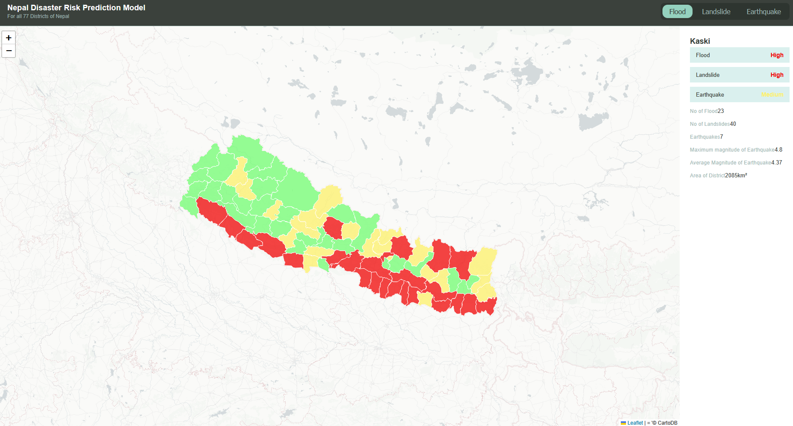

# Disaster Risk Prediction Model
> Provides an `accurate` prediction for disaster risks of different districts of Nepal.

## Use case
> Nepal sufferes the most due to various natural disasters every year. In order to try to counter with this, I have made a prediction model using Python and data from `BIPAD` and `USGSC` in order to predict if there is a chance of a landslide/Earthquake/Floods. It highlights the district based on risk level on the three disasters. With red being the one with the highest risk.

## Screenshot



## Caution
This model is not entirely accurate, due to the small 77 sample datasent and labels are derived from the same data.

## Demo

https://disaster-risk-prediction.vercel.app/


## Workings
1. The data is extracted from [bipadportal.gov.np](https://bipadportal.gov.np/) and [usgs.gov.np](https://usgs.gov.np)

2. Each of the incident is linked to Nepal's 77 districts using shapefiles.

3. XGBoost classifers was trained to predict flood and landslide risk(low/medium/high)

4. Vite and Leaflet front end was used to generate a map showing the risky and safe zones.


## Files used
- **Backend:** Python, FastAPI, XGBoost, Geopandas
- **Frontend:** React, Leaflet.js
- **Data:** BIPAD Portal, USGS Earthquake Catalog, HDX Nepal Admin Boundaries

## How to Run
```bash
cd backend
pip install -r requirements.txt
uvicorn main:app --reload

cd frontend
npm install
npm run dev
```

## Data sources
- BIPAD PORTAL
- USGS GOV US
- HDX(OCHA Services)